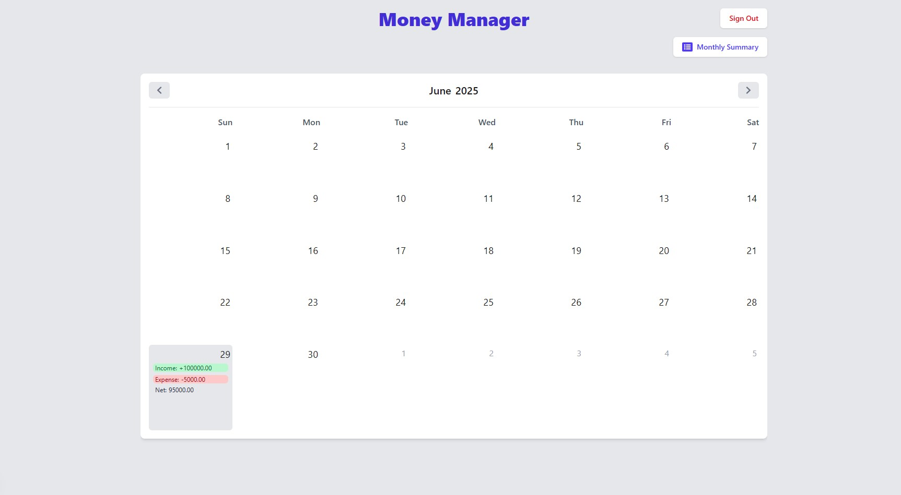
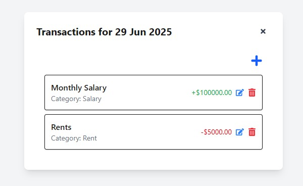
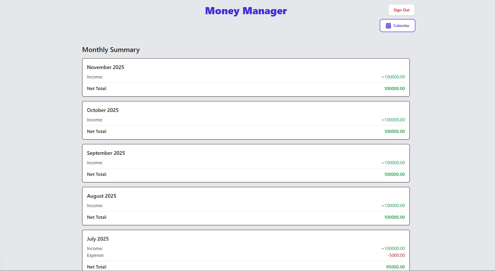

# Money Management

## Screenshots

### Dashboard


### Day-wise Transactions List


### Monthly View


This is a [Next.js](httpss://nextjs.org) project bootstrapped with [`create-next-app`](httpss://github.com/vercel/next.js/tree/canary/packages/create-next-app).

## Getting Started

First, run the development server:

```bash
npm run dev
# or
yarn dev
# or
pnpm dev
# or
bun dev
```

Open [http://localhost:3000](http://localhost:3000) with your browser to see the result.

## Available Scripts

In the project directory, you can run:

### `npm run dev`

Runs the app in the development mode using Turbopack.
Open [http://localhost:3000](http://localhost:3000) to view it in the browser.

The page will reload if you make edits.
You will also see any lint errors in the console.

### `npm run build`

Builds the app for production to the `.next` folder.
It correctly bundles React in production mode and optimizes the build for the best performance.

The build is minified and the filenames include the hashes.
Your app is ready to be deployed!

### `npm run start`

Starts the production server.
